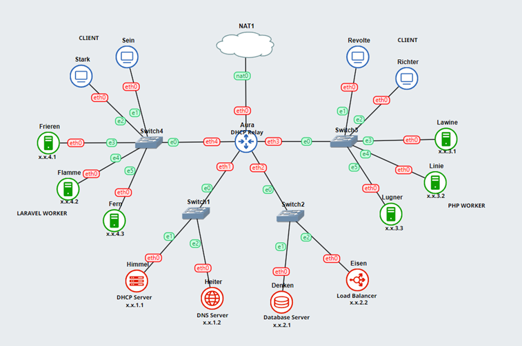
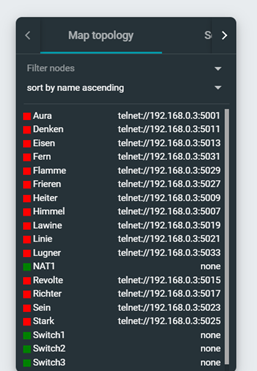
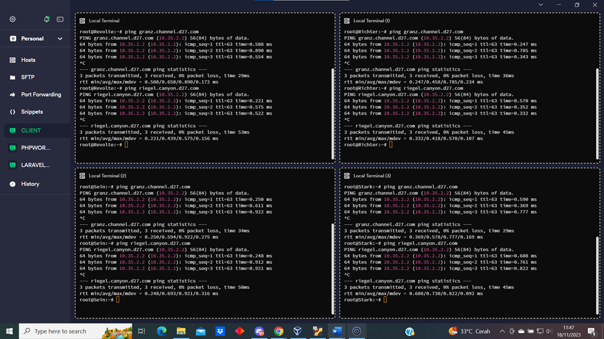
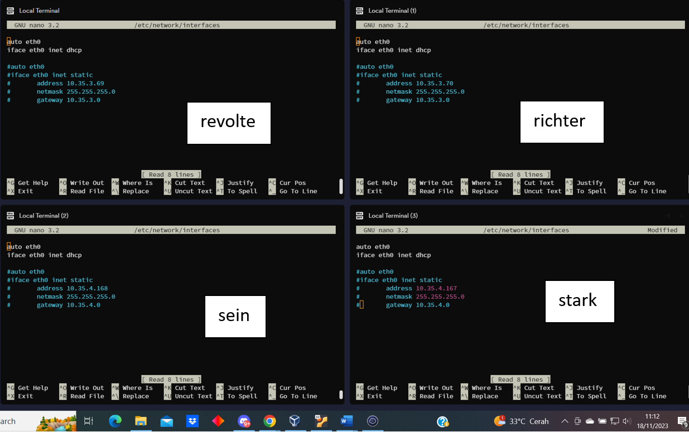
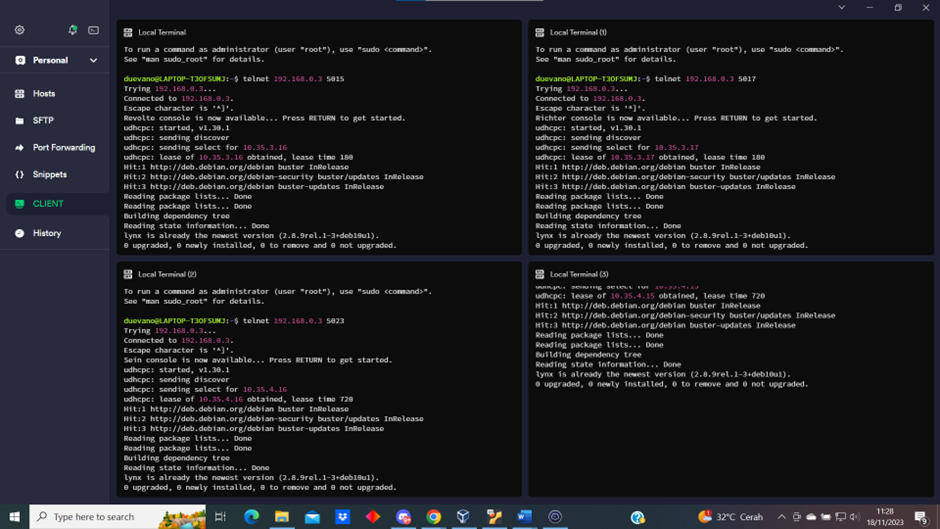

# Jarkom-Modul-3-D27-2023

Anggota Kelompok Jarkom D27:
* Duevano Fairuz Pandya (5025211052)
* 

----------------------------------------------------------------------------------------------------------------------------------
**PREFIX: 10.35.X.X**

LOKASI SHELL SCRIPT / KONFIGURASI TIAP NOMOR:
1. topologi
2. node Yudhistira
3. node Yudhistira
4. node Yudhistira
5. node Yudhistira
6. node Yudhistira, node Werkudara
7. node Yudhistira, node Werkudara
8. node Werkudara
9. node Arjuna, node Prabukusuma, node Abimanyu, node Wisanggeni 
10. node Arjuna, node Prabukusuma, node Abimanyu, node Wisanggeni
11. node Abimanyu
12. node Abimanyu
13. node Abimanyu, node Yudhistira
14. node Abimanyu
15. node Abimanyu
16. node Abimanyu
17. node Abimanyu
18. node Abimanyu
19. node Abimanyu
20. node Abimanyu


----------------------------------------------------------------------------------------------------------------------------------
Revisi:
* tidak ada


----------------------------------------------------------------------------------------------------------------------------------
# No. 1
### Soal
Yudhistira akan digunakan sebagai DNS Master, Werkudara sebagai DNS Slave, Arjuna merupakan Load Balancer yang terdiri dari beberapa Web Server yaitu Prabakusuma, Abimanyu, dan Wisanggeni. Buatlah topologi dengan pembagian sebagai berikut. Folder topologi dapat diakses pada drive berikut 

### Penyelesaian



* Gunakan fitur `Change hostname` untuk merubah nama
* Lalu kita setting network masing-masing node dengan fitur `Edit network configuration`
*  Yudhistira sebagai DNS Master
  ```
          auto eth0
          iface eth0 inet static
                address 10.35.1.3
	        netmask 255.255.255.0
	        gateway 10.35.1.1
 ```
* Werkudara sebagai DNS Slave
  ```
          auto eth0
          iface eth0 inet static
                address 10.35.1.2
	        netmask 255.255.255.0
	        gateway 10.35.1.1     
  ```
* Arjuna sebagai Load Balancer
  ```
          auto eth0
          iface eth0 inet static
	        address 10.35.2.2
	        netmask 255.255.255.0
	        gateway 10.35.2.1
   ```
Kendala: tidak ada

----------------------------------------------------------------------------------------------------------------------------------
# No. 2
### Soal
Buatlah website utama pada node arjuna dengan akses ke arjuna.yyy.com dengan alias www.arjuna.yyy.com dengan yyy merupakan kode kelompok.

### Penyelesaian



* Lakukan pada Node Yudistira.isikan seperti berikut:
```
        nano /etc/bind/named.conf.local
```
* Isikan configurasi domain arjuna.d27.com sesuai dengan syntax berikut:
  ```
          echo zone "arjuna.d27.com" {
	        type master;
	        file "/etc/bind/jarkom/arjuna.d27.com";
          };
  ```
* Buat folder jarkom di dalam `/etc/bind`
  ```
          mkdir /etc/bind/jarkom
  ```
* Copykan file db.local pada path /etc/bind ke dalam folder jarkom yang baru saja dibuat dan 
  ubah namanya menjadi arjuna.d27.com
  ```
          cp /etc/bind/db.local /etc/bind/jarkom/arjuna.d27.com
  ```
* Restart bind dengan perintah
  ```
          service bind9 restart
  ```

### Output


* Buka Node Nakula atau Sadewa lalu isikan `ping arjuna.d27.com`
* Untuk menghentikan ping tekan `Ctrl + C`

Kendala:


----------------------------------------------------------------------------------------------------------------------------------
