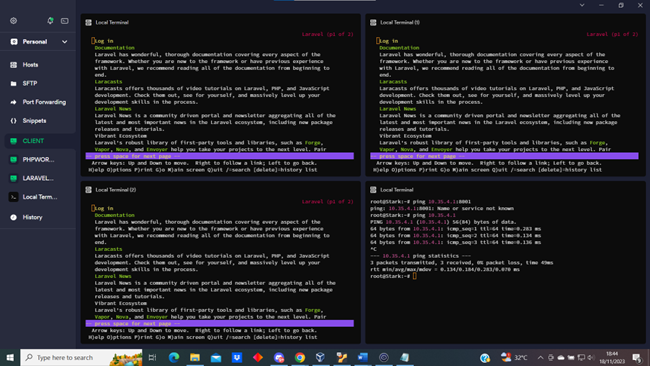

# Jarkom-Modul-3-D27-2023 (DHCP, Reverse Proxy, Laravel)

**File GNS-PROJECT: [Download disini](https://drive.google.com/file/d/1y11ZouuA_y9QNKshWwM7aWTxfMTAftxb/view?usp=sharing)**

**File GRIMOIRE: [Buka disini](https://docs.google.com/document/d/1iqQ7df3Q7cw7-deWoB5pyWaQEnqQNwwH/edit?usp=sharing&ouid=103928347637411344802&rtpof=true&sd=true)**

Anggota Kelompok Jarkom D27:
* Duevano Fairuz Pandya (5025211052)
* 

----------------------------------------------------------------------------------------------------------------------------------
**PREFIX: 10.35.X.X**

LOKASI SHELL SCRIPT / KONFIGURASI TIAP NOMOR:

* 0. Topologi, Heiter</br>
* 1-5. Himmel, Aura<br>
* 6. Lawine, Linie, Lugner
* 7. Eisen
* 8. Eisen
* 9. Eisen
* 10. Eisen
* 11. Eisen
* 12. Eisen 
* 13. Denken (Frieren, Flamme, Fern cukup install mariadb-client)
* 14. Frieren, Flamme, Fern</br>
* 15-17. Eisen
* 18. Eisen
* 19. Frieren, Flamme, Fern
* 20. Eisen
</br></br>

**KONFIG /root/.bashrc**</br>
Isi dari semua konfig /root/.bashrc di setiap node adalah penginstalan dependency yang dibutuhkan oleh setiap node (apt-get update, apt-get install, dan lainnya)

**KONFIG IP**</br>
Switch 1 & 2: Static IP
Switch 3 & 4: DHCP (tetapi tiap worker diset jadi dhcp fixed address)


----------------------------------------------------------------------------------------------------------------------------------
**Revisi:**
* tidak ada


----------------------------------------------------------------------------------------------------------------------------------
# No. 0
### Soal
Setelah mengalahkan Demon King, perjalanan berlanjut. Kali ini, kalian diminta untuk melakukan register domain berupa riegel.canyon.yyy.com untuk worker Laravel dan granz.channel.yyy.com untuk worker PHP **(0)** mengarah pada worker yang memiliki IP [prefix IP].x.1.

**Node  |       Kategori        |       Image Docker    |       Konfigurasi IP**</br>
* Aura	Router (DHCP Relay)	danielcristh0/debian-buster:1.1	Dynamic
* Himmel	DHCP Server	danielcristh0/debian-buster:1.1	Static
* Heiter	DNS Server	danielcristh0/debian-buster:1.1	Static
* Denken	Database Server	danielcristh0/debian-buster:1.1	Static
* Eisen	Load Balancer	danielcristh0/debian-buster:1.1	Static
* Frieren	Laravel Worker	danielcristh0/debian-buster:1.1	Static
* Flamme	Laravel Worker	danielcristh0/debian-buster:1.1	Static
* Fern	Laravel Worker	danielcristh0/debian-buster:1.1	Static
* Lawine	PHP Worker	danielcristh0/debian-buster:1.1	Static
* Linie	PHP Worker	danielcristh0/debian-buster:1.1	Static
* Lugner	PHP Worker	danielcristh0/debian-buster:1.1	Static
* Revolte	Client	danielcristh0/debian-buster:1.1	Dynamic
* Richter	Client	danielcristh0/debian-buster:1.1	Dynamic
* Sein	Client	danielcristh0/debian-buster:1.1	Dynamic
* Stark	Client	danielcristh0/debian-buster:1.1	Dynamic


### Penyelesaian


**Script di node Heiter:**
```sh
#!/bin/bash

echo 'zone "riegel.canyon.d27.com" {
    type master;
    file "/etc/bind/jarkom/riegel.canyon.d27.com";
};

zone "granz.channel.d27.com" {
    type master;
    file "/etc/bind/jarkom/granz.channel.d27.com";
};

zone "3.35.10.in-addr.arpa" {
    type master;
    file "/etc/bind/jarkom/3.35.10.in-addr.arpa";
};

zone "4.35.10.in-addr.arpa" {
    type master;
    file "/etc/bind/jarkom/4.35.10.in-addr.arpa";
};' > /etc/bind/named.conf.local

mkdir /etc/bind/jarkom
cp /etc/bind/db.local /etc/bind/jarkom/riegel.canyon.d27.com
cp /etc/bind/db.local /etc/bind/jarkom/granz.channel.d27.com
cp /etc/bind/db.local /etc/bind/jarkom/4.35.10.in-addr.arpa
cp /etc/bind/db.local /etc/bind/jarkom/3.35.10.in-addr.arpa


echo ';
; BIND data file for local loopback interface
;
$TTL    604800
@       IN      SOA     riegel.canyon.d27.com. root.riegel.canyon.d27.com. (
                        2023110101    ; Serial
                        604800        ; Refresh
                        86400         ; Retry
                        2419200       ; Expire
                        604800 )      ; Negative Cache TTL
;
@               IN      NS      riegel.canyon.d27.com.
@               IN      A       10.35.2.2       ; IP LB
www             IN      CNAME   riegel.canyon.d27.com.
' > /etc/bind/jarkom/riegel.canyon.d27.com


echo ';
; BIND data file for local loopback interface
;
$TTL    604800
@       IN      SOA     granz.channel.d27.com. root.granz.channel.d27.com. (
                        2023110101    ; Serial
                        604800        ; Refresh
                        86400         ; Retry
                        2419200       ; Expire
                        604800 )      ; Negative Cache TTL
;
@               IN      NS      granz.channel.d27.com.
@               IN      A       10.35.2.2       ; IP LB
www             IN      CNAME   granz.channel.d27.com.
' > /etc/bind/jarkom/granz.channel.d27.com

echo ';
; BIND data file for local loopback interface
;
$TTL    604800
@       IN      SOA     riegel.canyon.d27.com. root.riegel.canyon.d27.com. (
                        2023110101    ; Serial
                        604800        ; Refresh
                        86400         ; Retry
                        2419200       ; Expire
                        604800 )      ; Negative Cache TTL
;
4.35.10.in-addr.arpa.           IN      NS      riegel.canyon.d27.com.
1                               IN      PTR     riegel.canyon.d27.com.
' > /etc/bind/jarkom/4.35.10.in-addr.arpa

echo ';
; BIND data file for local loopback interface
;
$TTL    604800
@       IN      SOA     granz.channel.d27.com. root.granz.channel.d27.com. (
                        2023110101    ; Serial
                        604800        ; Refresh
                        86400         ; Retry
                        2419200       ; Expire
                        604800 )      ; Negative Cache TTL
;
3.35.10.in-addr.arpa.           IN      NS      granz.channel.d27.com.
1                               IN      PTR     granz.channel.d27.com.
' > /etc/bind/jarkom/3.35.10.in-addr.arpa

echo 'options {
        directory "/var/cache/bind";

        forwarders {
                192.168.122.1;
        };

        // dnssec-validation auto;
        allow-query{any;};
        auth-nxdomain no;    # conform to RFC1035
        listen-on-v6 { any; };
}; ' >/etc/bind/named.conf.options

service bind9 restart
```

* Melakukan konfigurasi dns seperti biasa
* Mengubah isi `/etc/bind/named.conf.local`
* Menambahkan direktori jarkom
* Membuat file `granz.channel.d27.com` dan `riege.canyon.d27.com` di dalam direktori jarkom
* Mengarahkan IP ke Loadbalancer (Eisen)

### Output

* Hasil uji ping ke domain yang telah dibuat


Kendala: sempat bingung mengarahkan IP ke worker atau LB, namun akhirnya memtuskan untuk mengarahkan ke LB karena agar Loadbalancing bisa berjalan

----------------------------------------------------------------------------------------------------------------------------------
# No. 1-5
### Soal
* Lakukan konfigurasi sesuai dengan peta yang sudah diberikan.
Kemudian, karena masih banyak spell yang harus dikumpulkan, bantulah para petualang untuk memenuhi kriteria berikut.:</br>
1. Semua CLIENT harus menggunakan konfigurasi dari DHCP Server.**(1)**
2. Client yang melalui Switch3 mendapatkan range IP dari [prefix IP].3.16 - [prefix IP].3.32 dan [prefix IP].3.64 - [prefix IP].3.80 **(2)**
3. Client yang melalui Switch4 mendapatkan range IP dari [prefix IP].4.12 - [prefix IP].4.20 dan [prefix IP].4.160 - [prefix IP].4.168 **(3)**
4. Client mendapatkan DNS dari Heiter dan dapat terhubung dengan internet melalui DNS tersebut **(4)**
5. Lama waktu DHCP server meminjamkan alamat IP kepada Client yang melalui Switch3 selama 3 menit sedangkan pada client yang melalui Switch4 selama 12 menit. Dengan waktu maksimal dialokasikan untuk peminjaman alamat IP selama 96 menit **(5)**


### Penyelesaian

* Melakukan konfigurasi di /etc/network/interfaces seperti gambar di atas

**Isi script node Himmel(DHCP Server):**
```sh
#!/bin/bash

echo 'subnet 10.35.1.0 netmask 255.255.255.0 {
}
subnet 10.35.2.0 netmask 255.255.255.0 {
}
subnet 10.35.3.0 netmask 255.255.255.0 {
    range 10.35.3.16 10.35.3.32;
    range 10.35.3.64 10.35.3.80;
    option routers 10.35.3.0;
    option broadcast-address 10.35.3.255;
    option domain-name-servers 10.35.1.2;
    min-lease-time 180;
    default-lease-time 180;
    max-lease-time 5760;
}
subnet 10.35.4.0 netmask 255.255.255.0 {
    range 10.35.4.12 10.35.4.20;
    range 10.35.4.160 10.35.4.168;
    option routers 10.35.4.0;
    option broadcast-address 10.35.4.255;
    option domain-name-servers 10.35.1.2;
    min-lease-time 720;
    default-lease-time 720;
    max-lease-time 5760;
}

host Lawine {
    hardware ethernet ae:f3:2f:92:6b:c1;
    fixed-address 10.35.3.1;
    default-lease-time 604800;
    max-lease-time 604800;
}
host Linie {
    hardware ethernet e6:34:be:1b:63:00;
    fixed-address 10.35.3.2;
    default-lease-time 604800;
    max-lease-time 604800;
}

host Lugner {
    hardware ethernet 82:e9:f1:ff:ab:3d;
    fixed-address 10.35.3.3;
    default-lease-time 604800;
    max-lease-time 604800;
}

host Frieren {
    hardware ethernet 86:aa:21:a7:c0:8c;
    fixed-address 10.35.4.1;
    default-lease-time 604800;
    max-lease-time 604800;
}

host Flamme {
    hardware ethernet d2:39:02:63:71:0f;
    fixed-address 10.35.4.2;
    default-lease-time 604800;
    max-lease-time 604800;
}

host Fern {
    hardware ethernet 32:a7:64:43:e5:32;
    fixed-address 10.35.4.3;
    default-lease-time 604800;
    max-lease-time 604800;
}
' >>  /etc/dhcp/dhcpd.conf

service isc-dhcp-server restart
```
* Setup masing-masing subnet dimana subnet (switch) 1 & 2 dibuat kosong karena memakai ip static, dan subnet 3 & 4 yang siap menerima DHCP
* Range IP yang bisa didapat oleh client sudah diatur sebagai mana seperti soal subnet 3 `range 10.35.3.16 10.35.3.32;` & `range 10.35.3.64 10.35.3.80;`
* dan subnet 4 adalah `range 10.35.4.12 10.35.4.20;` & `range 10.35.4.160 10.35.4.168;`
* Client otomatis mendapatkan nameserver dari dns server
* Lease time juga sudah diatur sebagaimana instruksi soal

**Isi script node Aura (DHCP Relay)**
```sh
#!/bin/bash

echo 'SERVERS="10.35.1.1" # IP Dhcp server(Himmel)
INTERFACES="eth1 eth2 eth3 eth4"
OPTIONS=
' > /etc/default/isc-dhcp-relay

echo 'net.ipv4.ip_forward=1
' > /etc/sysctl.conf

service isc-dhcp-relay restart
```
* Mengatur jalur mana saja (eth) yang akan dilewati broadcast dhcp server
* Mengarahkan ke dhcp server `SERVERS="10.35.1.1" # IP Dhcp server(Himmel)`


### Output


Kendala:


----------------------------------------------------------------------------------------------------------------------------------
# No. 6
### Soal
1.	Pada masing-masing worker PHP, lakukan konfigurasi virtual host untuk website berikut dengan menggunakan php 7.3. **(6)**


### Penyelesaian
**Isi script node Lawine, Linie, Lugner**
```sh
#!/bin/bash

wget -O /var/www/granz.channel.d27.zip "https://drive.google.com/uc?export=download&id=1k-qOmAmA7pwSwi5u04iTyFsreBp2CHxs"

sleep 5

unzip /var/www/granz.channel.d27.zip -d /var/www/

rm /var/www/granz.channel.d27.zip

echo ' server {

        listen 80;

        root /var/www/granz.channel.d27;

        index index.php index.html index.htm;
        server_name granz.channel.d27.com;

        location / {
                        try_files $uri $uri/ /index.php?$query_string;
        }

        # pass PHP scripts to FastCGI server
        location ~ \.php$ {
        include snippets/fastcgi-php.conf;
        fastcgi_pass unix:/var/run/php/php7.3-fpm.sock;
        }

 location ~ /\.ht {
                        deny all;
        }

        error_log /var/log/nginx/granz_error.log;
        access_log /var/log/nginx/granz_access.log;
 }
' > /etc/nginx/sites-available/granz

ln -s /etc/nginx/sites-available/granz /etc/nginx/sites-enabled

rm /etc/nginx/sites-available/default
rm /etc/nginx/sites-enabled/default

service nginx restart
service php7.3-fpm start
```
* Melakukan setup deployment website menggunakan nginx seperti biasa
* File resources di download lalu di ekstrak di dalam `/var/www`
* Mengubah server_name menjadi `granz.channel.d27.com`
* Melakukan link file konfig dengan command `ln -s /etc/nginx/sites-available/granz /etc/nginx/sites-enabled`

### Output


Kendala:


----------------------------------------------------------------------------------------------------------------------------------
# No. 7
### Soal
2.	Kepala suku dari Bredt Region memberikan resource server sebagai berikut:<br>
a.	Lawine, 4GB, 2vCPU, dan 80 GB SSD.<br>
b.	Linie, 2GB, 2vCPU, dan 50 GB SSD.<br>
c.	Lugner 1GB, 1vCPU, dan 25 GB SSD.<br>
aturlah agar Eisen dapat bekerja dengan maksimal, lalu lakukan testing dengan 1000 request dan 100 request/second. **(7)**


### Penyelesaian
**Isi script node Eisen:**
```sh
#!/bin/bash

echo '# Default menggunakan Round Robin
upstream backend  {
        server 10.35.3.1 weight=640; #IP Lawine
        server 10.35.3.2 weight=200; #IP Linie
        server 10.35.3.3 weight=25; #IP Lugner
}

server {
listen 80;
server_name granz.channel.d27.com;

        location / {
                proxy_pass http://backend;
                proxy_set_header    X-Real-IP $remote_addr;
                proxy_set_header    X-Forwarded-For $proxy_add_x_forwarded_for;
                proxy_set_header    Host $http_host;
        }

error_log /var/log/nginx/granz_error.log;
access_log /var/log/nginx/granz_access.log;

}
' > /etc/nginx/sites-available/lb-jarkom

unlink /etc/nginx/sites-enabled/default
ln -s /etc/nginx/sites-available/lb-jarkom /etc/nginx/sites-enabled
service nginx restart
```
* Menambahkan setup loadbalancing seperti biasa
* Menggunakan algoritma **weighted roundrobin** dengan bobot yang diperoleh berdasarkan perkalian resource yang tertera di soal
* Mengubah server_name menjadi granz.channel.d27.com
* Melakukan symlink `ln -s /etc/nginx/sites-available/lb-jarkom /etc/nginx/sites-enabled`

### Output


### ab testing
* Menjalankan command
```sh
ab -n 1000 -c 100 http://granz.channel.d27.com/
```
* Hasil dari benchmark dapat dilihat di [GRIMOIRE](https://docs.google.com/document/d/1iqQ7df3Q7cw7-deWoB5pyWaQEnqQNwwH/edit?usp=sharing&ouid=103928347637411344802&rtpof=true&sd=true)

Kendala:


----------------------------------------------------------------------------------------------------------------------------------
# No. 8
### Soal
3.	Karena diminta untuk menuliskan grimoire, buatlah analisis hasil testing dengan 200 request dan 10 request/second masing-masing algoritma Load Balancer dengan ketentuan sebagai berikut:<br>
a.	Nama Algoritma Load Balancer<br>
b.	Report hasil testing pada Apache Benchmark<br>
c.	Grafik request per second untuk masing masing algoritma.<br> 
d.	Analisis **(8)**


### Penyelesaian
* Melakukan sedikit perubahan di `lb-jarkom` milik node Eisen
* Melakukan pengetesan ab testing di setiap algoritma<br>

* **Algoritma A (roundrobin)**
```sh
upstream backend  {
        server 10.35.3.1; #IP Lawine
        server 10.35.3.2; #IP Linie
        server 10.35.3.3; #IP Lugner
}
```
* **Algoritma B (weighted roundrobin)**
```sh
upstream backend  {
        server 10.35.3.1 weight=100; #IP Lawine
        server 10.35.3.2 weight=50; #IP Linie
        server 10.35.3.3 weight=25; #IP Lugner
}
```
* **Algoritma C (least connection)**
```sh
upstream backend  {
        least_conn;
        server 10.35.3.1; #IP Lawine
        server 10.35.3.2; #IP Linie
        server 10.35.3.3; #IP Lugner
}
```
* **Algoritma D (iphash)**
```sh
upstream backend  {
        ip_hash;
        server 10.35.3.1; #IP Lawine
        server 10.35.3.2; #IP Linie
        server 10.35.3.3; #IP Lugner
}
```
* **Algoritma E (generic hash)**
```sh
upstream backend  {
        hash $request_uri consistent;
        server 10.35.3.1; #IP Lawine
        server 10.35.3.2; #IP Linie
        server 10.35.3.3; #IP Lugner
}
```

###ab testing
* Menjalankan command `ab -n 200 -c 10 http://granz.channel.d27.com/` di setiap algoritma

### Output
Hasil dan analisis dari ab testing dapat dilihat di [GRIMOIRE](https://docs.google.com/document/d/1iqQ7df3Q7cw7-deWoB5pyWaQEnqQNwwH/edit?usp=sharing&ouid=103928347637411344802&rtpof=true&sd=true)

Kendala:


----------------------------------------------------------------------------------------------------------------------------------
# No. 9
### Soal
4.	Dengan menggunakan algoritma Round Robin, lakukan testing dengan menggunakan 3 worker, 2 worker, dan 1 worker sebanyak 100 request dengan 10 request/second, kemudian tambahkan grafiknya pada grimoire. **(9)**


### Penyelesaian
Cukup menjalankan script Bernama `no8algoA.sh` di node Eisen lalu ubah isi upstream sebagai berikut setiap pengetesannya.<br>
**3 worker**<br>
<br>
**2 worker**<br>
<br>
**1 worker**<br>
<br>

### ab testing
Command: 
command ab testing: <br>
```sh
ab -n 100 -c 10 http://granz.channel.d27.com/
```

### Output
Hasil dari pengetesan ab testing dapat dilihat di [GRIMOIRE](https://docs.google.com/document/d/1iqQ7df3Q7cw7-deWoB5pyWaQEnqQNwwH/edit?usp=sharing&ouid=103928347637411344802&rtpof=true&sd=true)


Kendala:


----------------------------------------------------------------------------------------------------------------------------------
# No. 10
### Soal
5.	Selanjutnya coba tambahkan konfigurasi autentikasi di LB dengan dengan kombinasi username: “netics” dan password: “ajkd27”, dengan yyy merupakan kode kelompok. Terakhir simpan file “htpasswd” nya di /etc/nginx/rahasisakita/ **(10)**


### Penyelesaian
**Isi script node Eisen:**
```sh
#!/bin/bash

mkdir /etc/nginx/rahasiakita
htpasswd -c -i -b /etc/nginx/rahasiakita/.htpasswd netics ajkd27

echo '# Default menggunakan Round Robin
upstream backend  {
        server 10.35.3.1; #IP Lawine
        server 10.35.3.2; #IP Linie
        server 10.35.3.3; #IP Lugner
}

server {
listen 80;
server_name granz.channel.d27.com;

        location / {
                proxy_pass http://backend;
                proxy_set_header    X-Real-IP $remote_addr;
                proxy_set_header    X-Forwarded-For $proxy_add_x_forwarded_for;
                proxy_set_header    Host $http_host;

                auth_basic "Administrator Area";
                auth_basic_user_file /etc/nginx/rahasiakita/.htpasswd;
        }

        location ~ /\.ht {
            deny all;
        }

error_log /var/log/nginx/granz_error.log;
access_log /var/log/nginx/granz_access.log;

}
' > /etc/nginx/sites-available/lb-jarkom

service nginx restart
```
* Membuat folder rahasiakita di `/etc/nginx/`
* Menambahkan credentials menggunakan apache2-utils yakni `htpasswd` menggunakan command `htpasswd -c -i -b /etc/nginx/rahasiakita/.htpasswd netics ajkd27`
* Menambahkan atribut `auth_basic "Administrator Area";` & `auth_basic_user_file /etc/nginx/rahasiakita/.htpasswd;`


### Output
<br>
<br>
<br>
<br>
<br>

Kendala:


----------------------------------------------------------------------------------------------------------------------------------
# No. 11
### Soal
6.	Lalu buat untuk setiap request yang mengandung /its akan di proxy passing menuju halaman https://www.its.ac.id. **(11) hint: (proxy_pass)**


### Penyelesaian
**Isi script node Eisen:**
```sh
#!/bin/bash

echo '# Default menggunakan Round Robin
upstream backend  {
        server 10.35.3.1; #IP Lawine
        server 10.35.3.2; #IP Linie
        server 10.35.3.3; #IP Lugner
}

server {
listen 80;
server_name granz.channel.d27.com;

        location / {
                proxy_pass http://backend;
                proxy_set_header    X-Real-IP $remote_addr;
                proxy_set_header    X-Forwarded-For $proxy_add_x_forwarded_for;
                proxy_set_header    Host $http_host;

                auth_basic "Administrator Area";
                auth_basic_user_file /etc/nginx/rahasiakita/.htpasswd;
        }

        location /its {
                proxy_pass https://www.its.ac.id;
        }

        location ~ /\.ht {
            deny all;
        }

error_log /var/log/nginx/granz_error.log;
access_log /var/log/nginx/granz_access.log;

}
' > /etc/nginx/sites-available/lb-jarkom

service nginx restart
```
* Cukup menambahkan proxypass ke url its sebagai berikut
```
        location /its {
                proxy_pass https://www.its.ac.id;
        }
```

### Output
<br>


Kendala:


----------------------------------------------------------------------------------------------------------------------------------
# No. 12
### Soal
7.	Selanjutnya LB ini hanya boleh diakses oleh client dengan IP [Prefix IP].3.69, [Prefix IP].3.70, [Prefix IP].4.167, dan [Prefix IP].4.168. **(12) hint: (fixed in dulu clientnya)**


### Penyelesaian
**Isi script node Eisen:**
```sh
#!/bin/bash

echo '# Default menggunakan Round Robin
upstream backend  {
        server 10.35.3.1; #IP Lawine
        server 10.35.3.2; #IP Linie
        server 10.35.3.3; #IP Lugner
}

server {
listen 80;
server_name granz.channel.d27.com;

        location / {
                allow 10.35.3.69;
                allow 10.35.3.70;
                allow 10.35.4.167;
                allow 10.35.4.168;
                deny all;
                proxy_pass http://backend;
                proxy_set_header    X-Real-IP $remote_addr;
                proxy_set_header    X-Forwarded-For $proxy_add_x_forwarded_for;
                proxy_set_header    Host $http_host;

                auth_basic "Administrator Area";
                auth_basic_user_file /etc/nginx/rahasiakita/.htpasswd;
        }

        location /its {
                proxy_pass https://www.its.ac.id;
        }

        location ~ /\.ht {
            deny all;
        }

error_log /var/log/nginx/granz_error.log;
access_log /var/log/nginx/granz_access.log;

}
' > /etc/nginx/sites-available/lb-jarkom

service nginx restart
```
* Menambahkan IP yang disebutkan oleh soal dengan cara `allow [alamat ip];`
* Menolak semua request selain dari IP yang di allow dengan cara `deny all;`

### Output

* Lalu restart node stark (disini saya hanya mengubah network interfaces stark untuk mengetes)


Kendala:


----------------------------------------------------------------------------------------------------------------------------------
# No. 13
### Soal
Karena para petualang kehabisan uang, mereka kembali bekerja untuk mengatur riegel.canyon.yyy.com.
1. Semua data yang diperlukan, diatur pada Denken dan harus dapat diakses oleh Frieren, Flamme, dan Fern. **(13)**


### Penyelesaian
**Isi script node Denken:**
```sh
#!/bin/bash

service mysql start

mysql -u "root" -p"" -se "CREATE USER 'kelompokd27'@'%' IDENTIFIED BY 'passwordd27';"
mysql -u "root" -p"" -se "CREATE USER 'kelompokd27'@'localhost' IDENTIFIED BY 'passwordd27';"
mysql -u "root" -p"" -se "CREATE DATABASE dbkelompokd27;"
mysql -u "root" -p"" -se "GRANT ALL PRIVILEGES ON *.* TO 'kelompokd27'@'%';"
mysql -u "root" -p"" -se "GRANT ALL PRIVILEGES ON *.* TO 'kelompokd27'@'localhost';"
mysql -u "root" -p"" -se "FLUSH PRIVILEGES;"

echo '[mysqld]
skip-networking=0
skip-bind-address
' > /etc/mysql/my.cnf

service mysql restart
```
* Melakukan create user, create db, dan grant privileges
* Melakukan sedikit konfig di `/etc/mysql/my.cnf` untuk bypass bind-address tanpa pengamanan


### Output


Kendala:


----------------------------------------------------------------------------------------------------------------------------------
# No. 14
### Soal
2.	Frieren, Flamme, dan Fern memiliki Riegel Channel sesuai dengan quest guide berikut. Jangan lupa melakukan instalasi PHP8.0 dan Composer **(14)**


### Penyelesaian
**Isi script node Frieren, Flamme, Fern:**
```sh
#!/bin/bash

cp /var/www/laravel-praktikum-jarkom/.env.example /var/www/laravel-praktikum-jarkom/.env
echo 'APP_NAME=Laravel
APP_ENV=local
APP_KEY=
APP_DEBUG=true
APP_URL=http://localhost

LOG_CHANNEL=stack
LOG_DEPRECATIONS_CHANNEL=null
LOG_LEVEL=debug

DB_CONNECTION=mysql
DB_HOST=10.35.2.1
DB_PORT=3306
DB_DATABASE=dbkelompokd27
DB_USERNAME=kelompokd27
DB_PASSWORD=passwordd27

BROADCAST_DRIVER=log
CACHE_DRIVER=file
FILESYSTEM_DISK=local
QUEUE_CONNECTION=sync
SESSION_DRIVER=file
SESSION_LIFETIME=120

MEMCACHED_HOST=127.0.0.1

REDIS_HOST=127.0.0.1
REDIS_PASSWORD=null
REDIS_PORT=6379

MAIL_MAILER=smtp
MAIL_HOST=mailpit
MAIL_PORT=1025
MAIL_USERNAME=null
MAIL_PASSWORD=null
MAIL_ENCRYPTION=null
MAIL_FROM_ADDRESS="hello@example.com"
MAIL_FROM_NAME="${APP_NAME}"

AWS_ACCESS_KEY_ID=
AWS_SECRET_ACCESS_KEY=
AWS_DEFAULT_REGION=us-east-1
AWS_BUCKET=
AWS_USE_PATH_STYLE_ENDPOINT=false

PUSHER_APP_ID=
PUSHER_APP_KEY=
PUSHER_APP_SECRET=
PUSHER_HOST=
PUSHER_PORT=443
PUSHER_SCHEME=https
PUSHER_APP_CLUSTER=mt1

VITE_PUSHER_APP_KEY="${PUSHER_APP_KEY}"
VITE_PUSHER_HOST="${PUSHER_HOST}"
VITE_PUSHER_PORT="${PUSHER_PORT}"
VITE_PUSHER_SCHEME="${PUSHER_SCHEME}"
VITE_PUSHER_APP_CLUSTER="${PUSHER_APP_CLUSTER}"

' > /var/www/laravel-praktikum-jarkom/.env

php artisan migrate:fresh
php artisan db:seed --class=AiringsTableSeeder
php artisan jwt:secret
php artisan key:generate

echo 'server {

    listen 8001;

    root /var/www/laravel-praktikum-jarkom/public;

    index index.php index.html index.htm;
    server_name _;

    location / {
            try_files $uri $uri/ /index.php?$query_string;
    }

    # pass PHP scripts to FastCGI server
    location ~ \.php$ {
    include snippets/fastcgi-php.conf;
    fastcgi_pass unix:/var/run/php/php8.0-fpm.sock;
    }

location ~ /\.ht {
            deny all;
    }

    error_log /var/log/nginx/implementasi_error.log;
    access_log /var/log/nginx/implementasi_access.log;
}
' > /etc/nginx/sites-available/riegel

unlink /etc/nginx/sites-enabled/default
ln -s /etc/nginx/sites-available/riegel /etc/nginx/sites-enabled/
chown -R www-data.www-data /var/www/laravel-praktikum-jarkom/storage
service php8.0-fpm start
service nginx restart
```
* Melakukan sedikit config di file `.env`
* Menjalankan beberapa command php artisan
* Kalau di node flamme dan fern **gapake migrate fresh dan jwt**, selain itu untuk port nya berturut2 adalah 8002 dan 8003.
* Melakukan symlink dan chown

### Output



Kendala:


----------------------------------------------------------------------------------------------------------------------------------
# No. 15-17
### Soal
3.	Riegel Channel memiliki beberapa endpoint yang harus ditesting sebanyak 100 request dengan 10 request/second. Tambahkan response dan hasil testing pada grimoire.<br>
a.	POST /auth/register (15)<br>
b.	POST /auth/login (16)<br>
c.	GET /me (17)<br>


### Penyelesaian
**Isi script node Eisen:**
```sh
#!/bin/bash

echo 'upstream laravel {
        server 10.35.4.1:8001;
        server 10.35.4.2:8002;
        server 10.35.4.3:8003;
}

server {
        listen 80;
        server_name riegel.canyon.d27.com;

        location / {
                proxy_pass http://laravel;
        }
}
' > /etc/nginx/sites-available/lb-jarkom2

ln -s /etc/nginx/sites-available/lb-jarkom2 /etc/nginx/sites-enabled
service nginx restart
service php7.3-fpm restart
```
* Melakukan konfig loadbalancer seperti biasa dengan port ip masing-masing worker
* Melakukan symlink

**tes lb**


### no.15 POST /auth/register:<br>

curl:
```sh
curl -X POST "http://riegel.canyon.d27.com/api/auth/register" -d "username=duevano&password=duevano"
```


ab testing:
```sh
ab -n 100 -c 10 -p ~/postreg.json -T application/json http://riegel.canyon.d27.com/api/auth/register/
```

isi postreg.json:
```json
{
    "username": "jarkomEZ",
    "password": "jarkomEZ"
}
```

### no.16 POST /auth/login:<br>

curl:
```sh
curl -X POST "http://riegel.canyon.d27.com/api/auth/login" -d "username=duevano&password=duevano"
```


ab testing:
```sh
ab -n 100 -c 10 -p ~/postreg.json -T application/json http://riegel.canyon.d27.com/api/auth/login/
```

isi postreg.json:
```json
{
    "username": "jarkomEZ",
    "password": "jarkomEZ"
}
```

### no.17 GET /me<br>

curl:
```sh
curl -X GET "http://riegel.canyon.d27.com/api/me" -H "Authorization: Bearer [token yang barusan didapat]"
```


ab testing:
```sh
ab -n 100 -c 10 -H "Authorization: Bearer [token yang barusan didapat]" -r -k "http://riegel.canyon.d27.com/api/me"
```

### Output
Untuk hasil ab testing yang lebih lengkap bisa dilihat di [GRIMOIRE](https://docs.google.com/document/d/1iqQ7df3Q7cw7-deWoB5pyWaQEnqQNwwH/edit?usp=sharing&ouid=103928347637411344802&rtpof=true&sd=true)

Kendala:


----------------------------------------------------------------------------------------------------------------------------------
# No. 18
### Soal
4.	Untuk memastikan ketiganya bekerja sama secara adil untuk mengatur Riegel Channel maka implementasikan Proxy Bind pada Eisen untuk mengaitkan IP dari Frieren, Flamme, dan Fern. **(18)**


### Penyelesaian
**Isi script node Eisen:**
```sh
#!/bin/bash

echo 'upstream laravel {
        server 10.35.4.1:8001;
        server 10.35.4.2:8002;
        server 10.35.4.3:8003;
}

server {
        listen 80;
        server_name riegel.canyon.d27.com;

        location / {
                proxy_pass http://laravel;
        }

        location /frieren/ {
                # Frieren
                proxy_bind 10.35.2.2;
                proxy_pass http://10.35.4.1:8001/index.php;
        }

        location /flamme/ {
                # Flamme
                proxy_bind 10.35.2.2;
                proxy_pass http://10.35.4.2:8002/index.php;
        }

        location /fern / {
                # Fern
                proxy_bind 10.35.2.2;
                proxy_pass http://10.35.4.3:8003/index.php;
        }
}
' > /etc/nginx/sites-available/lb-jarkom2


ln -s /etc/nginx/sites-available/lb-jarkom2 /etc/nginx/sites-enabled
service nginx restart
service php7.3-fpm restart
```
* Sedikit Menambahkan masing-masing dari proxy bind IP Worker dengan kode 
```
        location /frieren/ {
                # Frieren
                proxy_bind 10.35.2.2;
                proxy_pass http://10.35.4.1:8001/index.php;
        }
```

### Output
lynx riegel.canyon.d27.com/frieren<br>
lynx riegel.canyon.d27.com/flamme<br>
lynx riegel.canyon.d27.com/fern<br>


Kendala:


----------------------------------------------------------------------------------------------------------------------------------
# No. 19
### Soal
5.	Untuk meningkatkan performa dari Worker, coba implementasikan PHP-FPM pada Frieren, Flamme, dan Fern. Untuk testing kinerja naikkan 
- pm.max_children
- pm.start_servers
- pm.min_spare_servers
- pm.max_spare_servers
sebanyak tiga percobaan dan lakukan testing sebanyak 100 request dengan 10 request/second kemudian berikan hasil analisisnya pada Grimoire.**(19)**


### Penyelesaian
* Default dari konfigurasi www.conf adalah 
```conf
pm = dynamic
pm.max_children = 5
pm.start_servers = 2
pm.min_spare_servers = 1
pm.max_spare_servers = 3
```
* Sehingga saya akan ubah dan uji secara bertahap dengan kombinasi:<br>
`pertama: 15 6 3 9` <br>
`kedua: 20 10 5 15` <br>
`ketiga: 30 15 7 20` <br>
* Berikut ini adalah contoh script yang saya pakai untuk mengubahnya:
**Isi script node Eisen (percobaan pertama):**
```sh
#!/bin/bash

echo '[www]
user = www-data
group = www-data
listen = /run/php/php8.0-fpm.sock
listen.owner = www-data
listen.group = www-data
pm = dynamic
pm.max_children = 15
pm.start_servers = 6
pm.min_spare_servers = 3
pm.max_spare_servers = 9
' > /etc/php/8.0/fpm/pool.d/www.conf

service php8.0-fpm start
service nginx restart
```
* Melakukan perubahan di pool nginx `/etc/php/8.0/fpm/pool.d/www.conf`
* Mengubah jumlah pm.max_children, pm.start_servers, pm.min_spare_servers, dan pm.max_spare_servers di setiap pengujian ab testing

### ab testing
Menjalankan command
```sh
ab -n 100 -c 10 http://riegel.canyon.d27.com/
```

### Output
(15 6 3 9) <br>


(20 10 5 15) <br>


(30 15 7 20) <br>


* Bisa disimpulkan dengan meningkatkan jumlah atribut di atas dapat meningkatkan performa loadbalancing dari setiap worker
* Selain itu juga meminimalisir penggunaan CPU dari setiap worker
* Untuk detail lebih jelasnya bisa dilihat di [GRIMOIRE](https://docs.google.com/document/d/1iqQ7df3Q7cw7-deWoB5pyWaQEnqQNwwH/edit?usp=sharing&ouid=103928347637411344802&rtpof=true&sd=true)


Kendala:


----------------------------------------------------------------------------------------------------------------------------------
# No. 20
### Soal
6.	Nampaknya hanya menggunakan PHP-FPM tidak cukup untuk meningkatkan performa dari worker maka implementasikan Least-Conn pada Eisen. Untuk testing kinerja dari worker tersebut dilakukan sebanyak 100 request dengan 10 request/second. **(20)**


### Penyelesaian
**Isi script node Eisen:**
```sh
#!/bin/bash

echo 'upstream laravel {
        least_conn;
        server 10.35.4.1:8001;
        server 10.35.4.2:8002;
        server 10.35.4.3:8003;
}

server {
        listen 80;
        server_name riegel.canyon.d27.com;

        location / {
                proxy_pass http://laravel;
        }

        location /frieren/ {
                # Frieren
                proxy_bind 10.35.2.2;
                proxy_pass http://10.35.4.1:8001/index.php;
        }

        location /flamme/ {
                # Flamme
                proxy_bind 10.35.2.2;
                proxy_pass http://10.35.4.2:8002/index.php;
        }

        location /fern/ {
                # Fern
                proxy_bind 10.35.2.2;
                proxy_pass http://10.35.4.3:8003/index.php;
        }
}
' > /etc/nginx/sites-available/lb-jarkom2


ln -s /etc/nginx/sites-available/lb-jarkom2 /etc/nginx/sites-enabled
service nginx restart
service php7.3-fpm restart
```
* Cukup menambahkan kode `least_conn;` di dalam upstream loadbalancer

## ab testing
Menjalankan command
```sh
ab -n 100 -c 10 http://riegel.canyon.d27.com/
```

### Output

* Untuk lebih jelasnya bisa dicek di [GRIMOIRE](https://docs.google.com/document/d/1iqQ7df3Q7cw7-deWoB5pyWaQEnqQNwwH/edit?usp=sharing&ouid=103928347637411344802&rtpof=true&sd=true)


Kendala:


----------------------------------------------------------------------------------------------------------------------------------